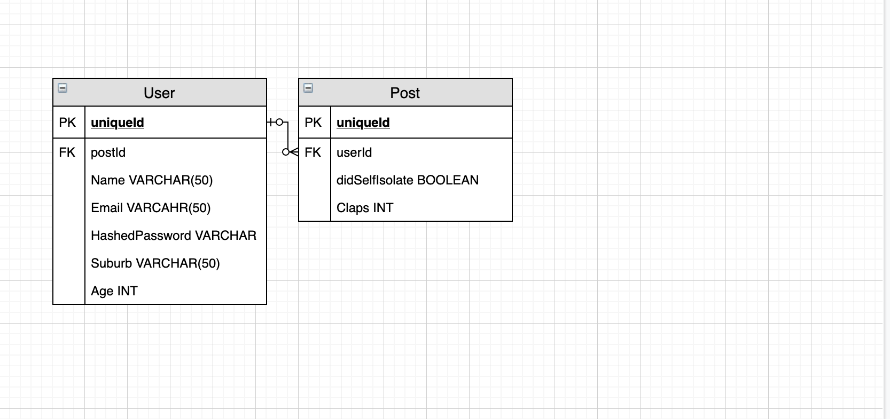
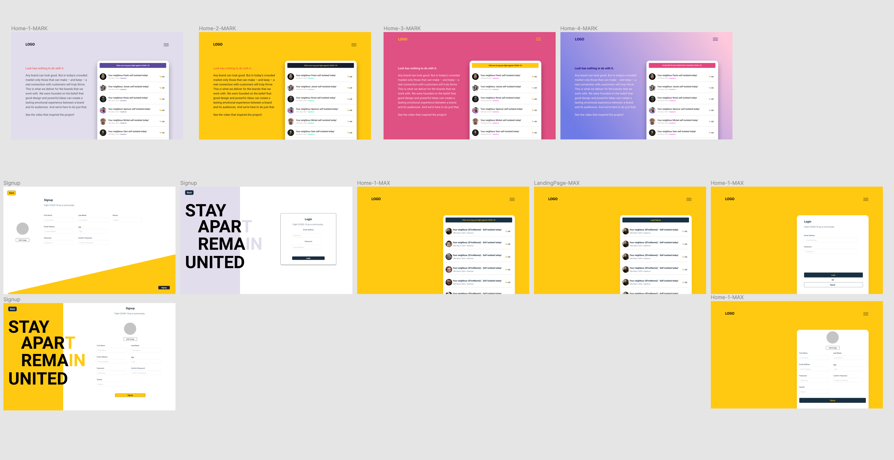
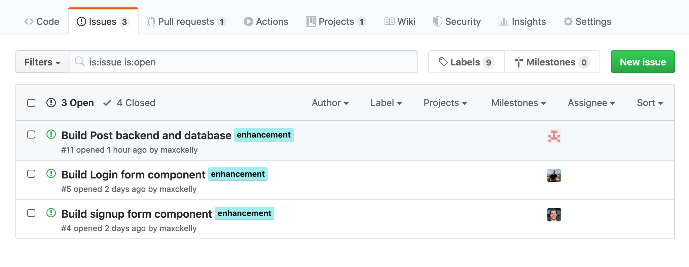
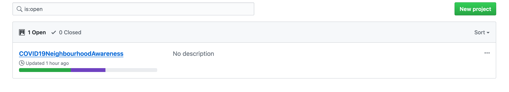
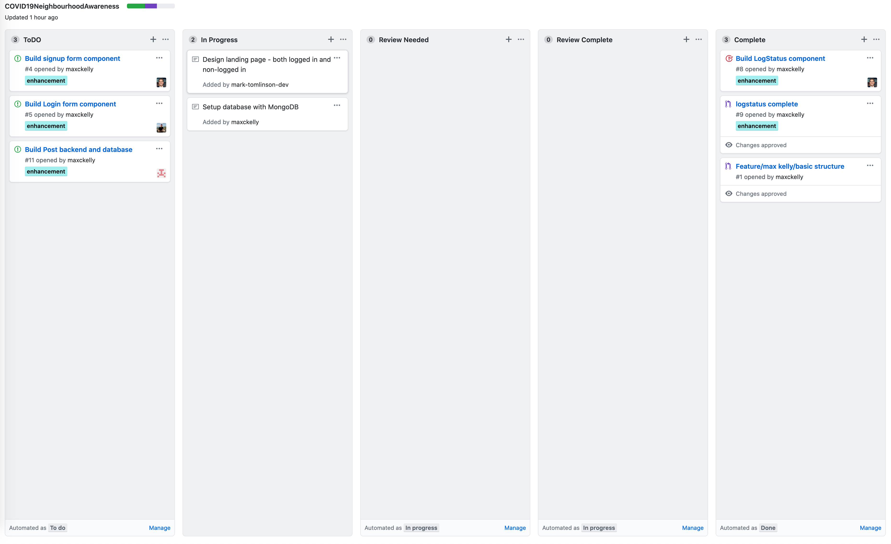

# How to run

  1. Run `npm i` in root
  2. In your terminal run `cd client`
  3. In `client` run `npm i`
  4. In root run `npm run dev` this will start both the back-end and the front-end 

# COVID-19 Community Project

  - This project was planned, designed and developed my Mark Tominson, Mahes Varier and Max Kelly. 
  - The idea of this project came from a 7:30 news report saying how the only way to defeat this virus is if we all work as a community. This got us thinking on how we can make the community more aware of what each person is doing on a simple level of just reporting they self-isolated to the people in their suburbs. 
  - The future of this project is that we want communities to post what they need assistance with whether that be walking their dog, getting groceries etc... This would all be volunteer work. The aim of this is to activate the community to help one another.

## ERD

  - Below is the development life of our ERD. For our MVP you can see we started very simple and wanted to get something up as quickly as possible. However as we progress we add more features.

  

## Design

  - The design life of this project is evolving constantly as we think of new features. However in the beginning we kept is simple and only the core of the site was designed for the MVP. 

  

  

  

  

## Project management

  - The project management tool we used for this project was Github projects. We automated this a lot with the issues and cards. As you can see below.

  

  

  

